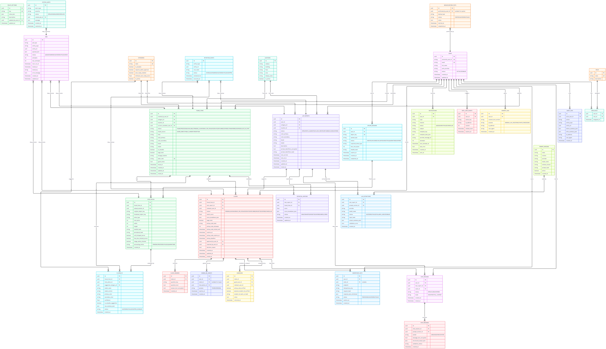

# Database — PostgreSQL

Owner: engineering · Status: ideal baseline
Cross-refs: system-architecture.md · ADR-001

## 1. Why PostgreSQL
Strong relational integrity: partial unique indexes, CHECK constraints, FKs, JSONB, and it backs the Procrastinate job queue (no extra infra). See ADR-001.

## 2. ER diagram



> Full resolution: [assets/er-diagram.png](assets/er-diagram.png)

## 3. Constraints and indexes (apply in DB)

```sql
-- Safety-critical uniqueness
CREATE UNIQUE INDEX uniq_active_claim_per_found_item
ON claims (found_item_id)
WHERE status IN ('PENDING_REVIEW', 'READY_FOR_PICKUP', 'DISPUTED');

CREATE UNIQUE INDEX uniq_idempotency_key
ON idempotency_keys (user_id, endpoint, idempotency_key);

CREATE UNIQUE INDEX uniq_rate_limit_user_window
ON rate_limit_events (user_id, action_key, window_start);

CREATE UNIQUE INDEX uniq_found_items_label_code
ON found_items (label_code);

-- Lookup indexes
CREATE INDEX idx_found_items_lookup ON found_items (status, category_id, location_id);
CREATE INDEX idx_lost_reports_lookup ON lost_reports (status, category_id, location_id);
CREATE INDEX idx_claims_found_item_status ON claims (found_item_id, status);
CREATE INDEX idx_claims_claimant_status ON claims (claimant_user_id, status);
CREATE INDEX idx_potential_matches_report_status ON potential_matches (lost_report_id, status);
CREATE INDEX idx_potential_matches_item_status ON potential_matches (found_item_id, status);
CREATE INDEX idx_notifications_retry ON notifications (status, next_attempt_at);
CREATE INDEX idx_jobs_runnable ON jobs (status, next_run_at);

-- Expiry / cleanup indexes
CREATE INDEX idx_claims_expiry ON claims (status, pickup_deadline);
CREATE INDEX idx_lost_reports_expiry ON lost_reports (status, created_at);
CREATE INDEX idx_upload_sessions_expiry ON upload_sessions (status, expires_at);
CREATE INDEX idx_retention_events_due ON retention_events (status, scheduled_for);

-- Status integrity (CHECK constraints)
ALTER TABLE users ADD CONSTRAINT users_status_check CHECK (status IN ('ACTIVE','DISABLED'));
ALTER TABLE upload_sessions ADD CONSTRAINT upload_sessions_status_check CHECK (status IN ('CREATED','UPLOADED','VALIDATED','REJECTED','QUARANTINED','EXPIRED'));
ALTER TABLE found_items ADD CONSTRAINT found_items_status_check CHECK (status IN ('FOUND','PROCESSING','AVAILABLE','PENDING_CLAIM','READY_FOR_PICKUP','DISPUTED','RETURNED','EXPIRED','TRANSFERRED','DISPOSED','LOST_BY_STAFF'));
ALTER TABLE found_items ADD CONSTRAINT found_items_intake_source_check CHECK (intake_source IN ('GUARD_DIRECT','PUBLIC_HANDOFF','RECEPTION'));
ALTER TABLE item_photos ADD CONSTRAINT item_photos_processing_status_check CHECK (processing_status IN ('PENDING','PROCESSED','FAILED','QUARANTINED'));
ALTER TABLE cv_results ADD CONSTRAINT cv_results_status_check CHECK (status IN ('SUCCEEDED','FAILED','SKIPPED_DISABLED'));
ALTER TABLE lost_reports ADD CONSTRAINT lost_reports_status_check CHECK (status IN ('OPEN','MATCH_SUGGESTED','CLAIM_CREATED','RETURNED','CLOSED','EXPIRED'));
ALTER TABLE potential_matches ADD CONSTRAINT potential_matches_status_check CHECK (status IN ('NEW','CONVERTED','REJECTED','EXPIRED','NEEDS_PROOF'));
ALTER TABLE claims ADD CONSTRAINT claims_status_check CHECK (status IN ('PENDING_REVIEW','READY_FOR_PICKUP','DISPUTED','RETURNED','REJECTED','EXPIRED','CANCELLED'));
ALTER TABLE idempotency_keys ADD CONSTRAINT idempotency_keys_status_check CHECK (status IN ('PROCESSING','SUCCEEDED','FAILED'));
ALTER TABLE notifications ADD CONSTRAINT notifications_status_check CHECK (status IN ('QUEUED','SENT','FAILED','CANCELLED'));
ALTER TABLE jobs ADD CONSTRAINT jobs_status_check CHECK (status IN ('QUEUED','RUNNING','SUCCEEDED','FAILED','DEAD'));
ALTER TABLE llm_extractions ADD CONSTRAINT llm_extractions_status_check CHECK (status IN ('SUCCEEDED','FAILED','FALLBACK_USED','DISABLED'));
ALTER TABLE chat_sessions ADD CONSTRAINT chat_sessions_status_check CHECK (status IN ('OPEN','CLOSED','EXPIRED'));
ALTER TABLE system_alerts ADD CONSTRAINT system_alerts_status_check CHECK (status IN ('OPEN','ACKNOWLEDGED','RESOLVED'));
ALTER TABLE backup_restore_tests ADD CONSTRAINT backup_restore_tests_status_check CHECK (status IN ('STARTED','SUCCEEDED','FAILED'));
ALTER TABLE retention_events ADD CONSTRAINT retention_events_status_check CHECK (status IN ('SCHEDULED','RUNNING','SUCCEEDED','FAILED','SKIPPED'));
```

## 4. Data protection rules
- Encrypted fields: `lost_reports.private_identifiers_encrypted`, `claim_answers.answer_text_encrypted`, `chat_messages.message_text_encrypted`. Keys live in a secret manager/KMS — never in code or DB.
- `private_identifiers_hash` exists only as a normalized lookup if matching on identifiers is ever needed.
- Student ID is never stored in full (`student_id_last4_or_hash` at most).
- Audit/notification payloads are minimized; raw LLM/CV JSON is summarized and purged per retention.

## 5. Retention rules
- Retention only runs on closed/eligible records: RETURNED, REJECTED, EXPIRED, CANCELLED, DISPOSED, TRANSFERRED — after the retention window.
- Always skipped while: active claim, DISPUTED status, or `legal_hold = true`.
- Purge order: photos → chat/LLM data → notification template data → idempotency keys → anonymize old audit logs.

## 6. Backup
- Scheduled DB backup + object storage protection; periodic restore test to staging; failures raise SYSTEM_ALERTS. See Sequence Phase 7 (assets/sequence-diagram.png).