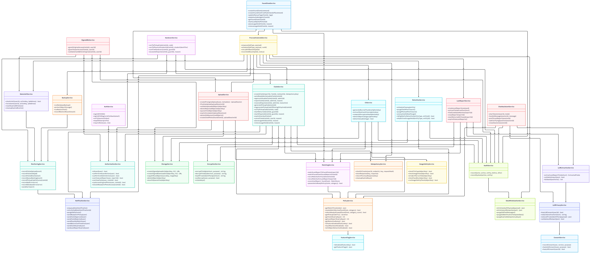
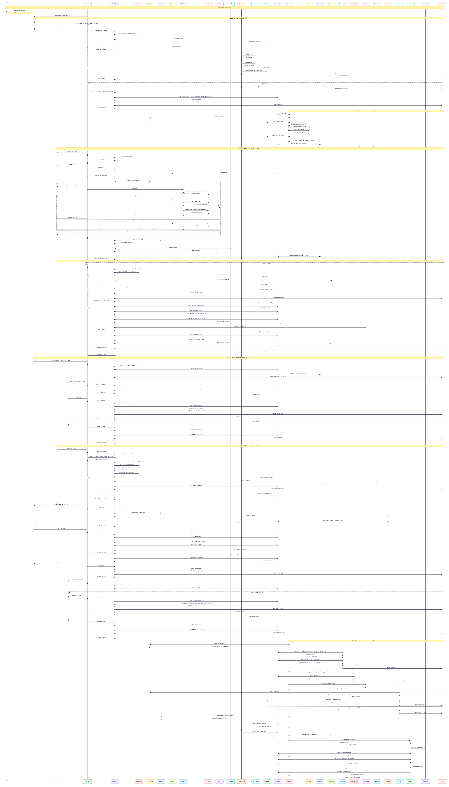

# System Architecture — AU Smart Lost & Found

Owner: engineering · Status: ideal baseline · Last updated: 2026
Cross-refs: database.md · api-design.md · auth.md · permissions.md · integration.md
## 1. Overview
A secure, auditable campus lost-and-found platform that connects finders, guards, students, and admins.
Items enter the system only through physical handover to a guard/reception (chain of custody), are stored privately, matched deterministically with lost reports, and returned only after policy checks, admin review (for risky items), and physical ID verification.

## 2. Tech Stack 

### Core (used in v1)
| Layer | Technology | Purpose | Status |
|---|---|---|---|
| Web frontend | React + TypeScript | SPA for student/guard/admin | Core |
| File upload | Uppy | progress, retry, direct-to-storage | Core |
| Backend API | FastAPI (Python) + Pydantic | endpoints, validation, authz | Core |
| Auth | Authlib + AU SSO (OIDC/SAML) | login, session, role mapping (magic link disabled) | Core (ADR-002) |
| Database | PostgreSQL | relational data, constraints, queue backing | Core (ADR-001) |
| DB migrations | Alembic | version-controlled schema changes | Core |
| Background jobs | Procrastinate | retries + scheduled maintenance (same Postgres) | Core |
| Object storage | Cloudflare R2 *(or AU-approved S3)* | private originals + thumbnails, signed URLs | Core (AU approval) |
| QR codes | `qrcode` (Python) + `qrcode.react` (web) | pickup QR + item label QR for guard scanning | Core |
| LLM assistant | Google Gemini (approved/paid tier only) | smart prefill; consent-gated, redacted, form fallback | Core |
| Email | AU SMTP / approved provider | queued notifications with retry | Core |
| Monitoring | MonitoringService + SYSTEM_ALERTS | alerts for jobs/emails/uploads/backups | Core |
| Secrets | env vars + secret manager (`.env.example` in repo) | DB/R2/Gemini/encryption keys — never in code | Core |
| Hosting | AU-approved hosting / subdomain | staging + production per ADR-003 | Pending AU approval |

### Optional / feature-flagged (used only when enabled)
| Layer | Technology | Purpose |
|---|---|---|
| Client face blur | MediaPipe Face Detector | best-effort blur before upload (server re-checks) |
| Server image processing | OpenCV | thumbnail, blur, dominant colors, pHash |
| Object detection | ONNX Runtime | category suggestion only (flag OFF by default) |
| Local dev | Docker Compose | one-command local Postgres + services (delete row if unused) |

### Why each choice
- React+TS: three role dashboards, type safety, phone/tablet friendly for guards.
- FastAPI+Pydantic: strict validation at boundary, async, staging OpenAPI.
- PostgreSQL: safety relies on real constraints (one active claim, idempotency, status checks).
- Procrastinate: same Postgres, no extra Redis infra.
- R2/S3: private bucket + short-lived signed URLs; originals never public.
- Uppy: resumable uploads on bad campus Wi-Fi; direct-to-storage.
- MediaPipe: first pass only; server ImageSafetyService is the authority.
- Authlib+SSO: no passwords; roles from IdP.
- Gemini: convenience feature with mandatory fallback; core works if it is down.

### Explicitly NOT used in v1
No Redis/RabbitMQ · No MongoDB · No public buckets/CDN for photos · No free-tier LLM for real data · No native mobile apps · No SSR framework.

### Version policy
Pin exact versions (lockfiles); staging mirrors prod; schema changes only via migrations; any new technology = new ADR in `06-decisions/` before use.

## 3. Actors
| Actor | Role in system |
|---|---|
| Finder (student/staff/visitor) | Physically hands item to guard/reception. No app access for found items. |
| Guard | Intake, tags, pickup verification, handover, dispute escalation. Rule: ACTIVE + GUARD role. |
| Student | Reports loss, claims, views status, picks up item. |
| Admin | Approves/rejects risky claims, resolves disputes, manages policies. |
| System (workers) | CV, matching, expiry, retention, notifications, cleanup, backups, monitoring. |

## 4. Runtime phases
- **Phase 0 — Public handoff:** Finder physically hands item to guard/reception; `intake_source` recorded.
- **Phase 1 — Guard intake:** presigned upload → server validation (type/size/EXIF/face-blur/safety) → reject/quarantine on failure → item created → CV job enqueued.
- **Phase 2 — CV + reverse matching:** thumbnail/color/pHash (+ optional object detection) → match found item against open lost reports.
- **Phase 3 — Student lost report:** consent → LLM prefill (consent-gated, redacted, form fallback) or direct structured form → private identifiers encrypted → match against found items.
- **Phase 4 — Claim creation:** idempotency + rate limit + ownership → weak = NEEDS_PROOF (no active claim); strong = one active claim → auto-ready (low-risk) or PENDING_REVIEW (valuable/approval-required).
- **Phase 5 — Manual edits + admin review:** edits trigger rematch; admin approves (code generated) or rejects (item available, match rejected).
- **Phase 6 — Pickup & dispute:** original photo only if READY + not expired + not DISPUTED + no legal hold; guard verifies code + physical student ID; success = RETURNED; failure = dispute → admin resolves.
- **Phase 7 — Maintenance:** expire overdue claims, expire stale reports, retry emails, retention (skip active/disputed/legal-hold), cleanup (rate limits, uploads, quarantine, idempotency, chat), backups + restore tests, alerts.

## 5. Key invariants
1. Public finders never create found items digitally.
2. Guard permission = `user.status == ACTIVE AND user.hasRole(GUARD)` (no location scoping in v1).
3. One active claim per found item (DB partial unique index).
4. Original photo access: owner + READY + not expired + not DISPUTED + not legal_hold.
5. Auto-ready only if category allows + not valuable + not approval-required + score ≥ threshold.
6. Retention skips active/disputed/legal-hold records.
7. LLM assistant is ON with consent + privacy guardrails; CV object detection is flag-gated. Core flow still works if the LLM provider is down (fallback to structured form).
8. Every important action is audited with minimized payloads.

## 6. Class diagram (service design)

> Full resolution: [assets/class-diagram.png](assets/class-diagram.png)

## 7. Sequence diagram (single consolidated lifecycle)

> Full resolution: [assets/sequence-diagram.png](assets/sequence-diagram.png)

## 8. Environments
dev → staging → production. Separate configs; no secrets in repo; staging mirrors prod versions.
Deployment approach: [integration.md](integration.md) and ADR-003.
